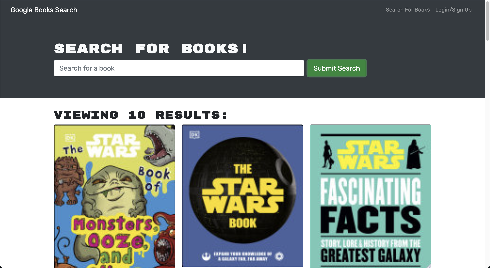

# Book Search Engine

  

  ## Description
  The challenge for this week involves converting a book search engine built with REST API to one using a GraphQL API
  with Apollo Server instead. This involves setting up an Apollo Server to use GraphQL queries and mutations, modifying the existing middleware to work with GraphQL and adapting the app to communicate with the Apollo Server.

  ## Table of Contents

* [Installation](#installation)
* [Usage](#usage)
* [License](#license)
* [Deployment](#deployment)
* [Questions](#questions)

## Installation
1: Clone the repository from Github 2:  Run NPM Install to install the modules 3:  Run "npm run develop" to start the server 4:  Access the website at http://localhost:3000/ or  

## Usage

## License
https://opensource.org/licenses/MPL-2.0  
Licensed under Mozilla Public License 2.0

## Deployment
Heroku: 

## Questions
https://github.com/askarrizvi  
